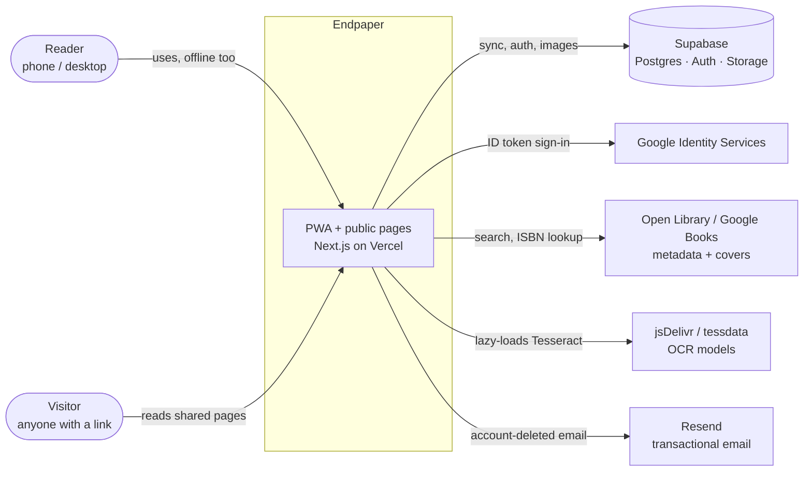
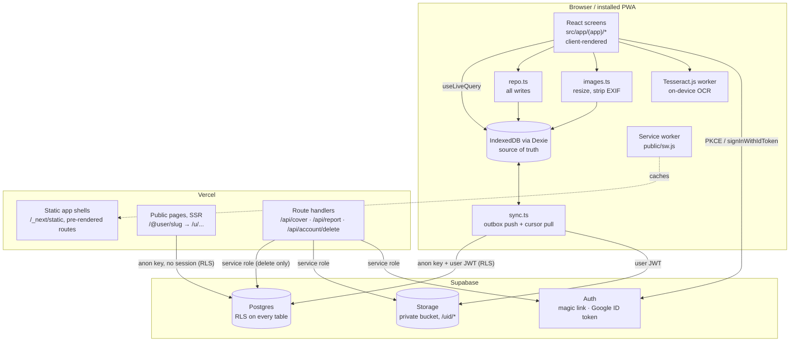
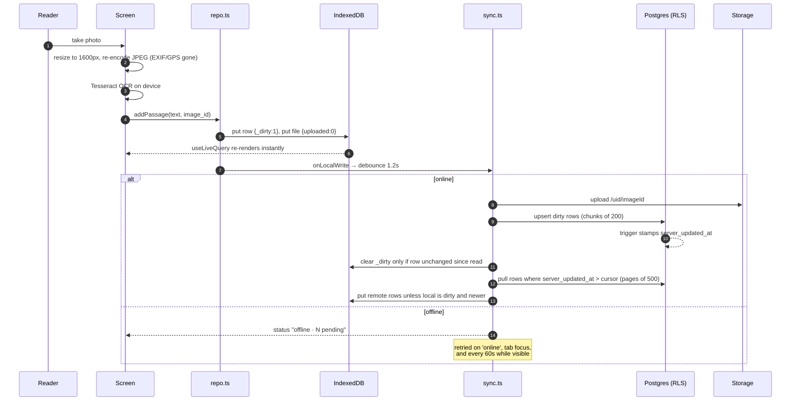
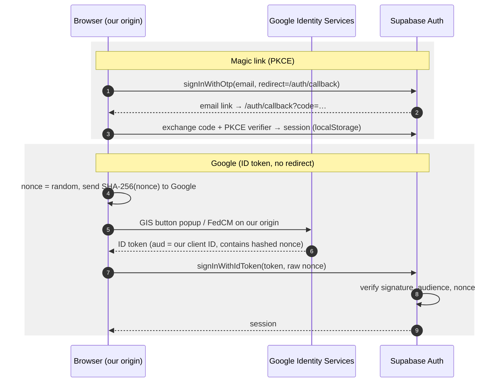
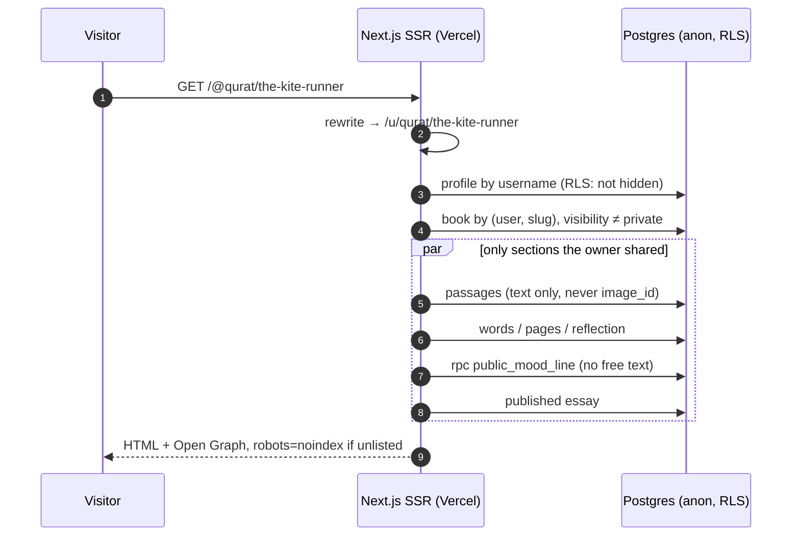
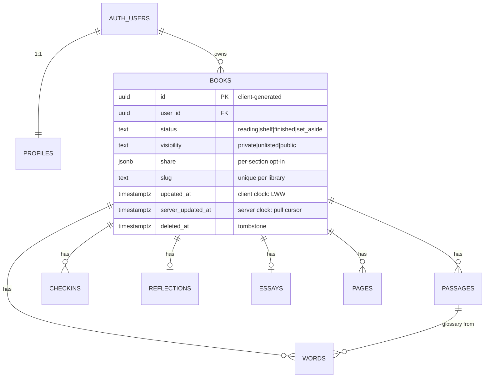
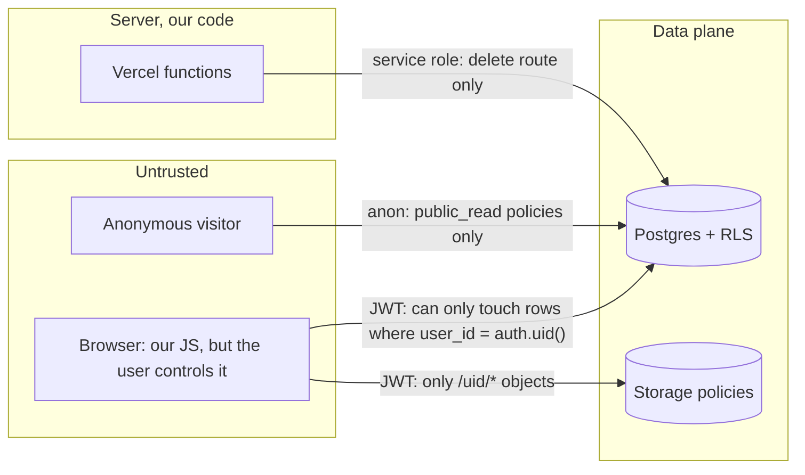
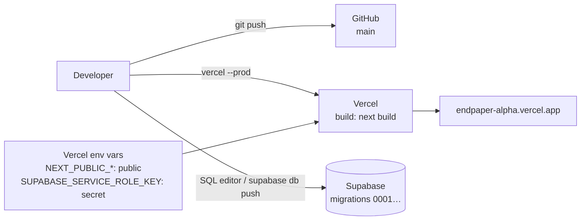

# Endpaper: System Architecture

Endpaper is an installable, offline-first PWA for keeping what you read: books, photographed passages (OCR'd on device), words, mood check-ins, reflections, essays and scrapbook pages. You can share a curated, read-only page per book at `/@username/<book>`.

This document describes the system as built, the reasoning behind each decision with the alternatives that were rejected, and how it holds up for scalability, security, privacy, accessibility, observability and reliability. Where something is **not built yet**, it is marked as such and moved to the roadmap (§10). Smaller decisions are logged in [DECISIONS.md](DECISIONS.md).

---

## 1. Goals and constraints

| # | Driver | Consequence for the architecture |
|---|---|---|
| G1 | **Capture must work with no signal** (reading on a train, in a basement café) | The device, not the server, is the source of truth. Offline is the normal case, not an error path. |
| G2 | **Private by default**, sharing is opt-in per book and per section | Authorization lives in the database (RLS), not only in app code. Public reads go through a separate, narrow path. |
| G3 | **Single owner per record**, few devices per user | Conflict resolution can be simple (row-level last-write-wins). No CRDTs or collaborative editing. |
| G4 | **Solo developer, near-zero running cost** | Managed services (Vercel and Supabase), no servers to patch, and as few moving parts and dependencies as possible. |
| G5 | **Public pages must be shareable and indexable** | Public pages are server-rendered with Open Graph metadata; private pages need neither. |
| G6 | **UK GDPR**: export everything, delete everything | Export is a single ZIP built from local data. Delete is one server call that cascades. Photos are never public. |

Non-goals: real-time collaboration, social feeds, recommendations, native apps.

---

## 2. System context

Every third party is **optional at runtime**. Book search failing means you type the book in by hand. OCR failing means you type the passage. Resend missing means no goodbye email. With no Supabase config at all, the app runs in **device-only mode** (one local account, no sync, no public pages), which is also how the E2E suite runs.

---

## 3. Containers and responsibilities

| Container | Runs where | Talks to Supabase as | Why it exists |
|---|---|---|---|
| Private app (`src/app/(app)/*`) | Browser only | Signed-in user (JWT, RLS-scoped) | All reading and writing; must open offline |
| IndexedDB (`src/lib/db.ts`) | Browser | n/a | The UI's single source of truth (G1) |
| Sync engine (`src/lib/sync.ts`) | Browser | Signed-in user | Reconciles the local DB with Postgres in the background |
| Service worker (`public/sw.js`) | Browser | Never (Supabase traffic bypasses it) | Precaches app shells, fonts, covers and OCR models |
| Public pages (`src/app/u/*`) | Vercel, server-rendered | `anon`, no session | Shareable, crawlable pages (G5); RLS decides what is visible |
| `/api/cover` | Vercel function | n/a | Same-origin cover proxy so "Save as image" can draw covers that lack CORS headers |
| `/api/report` | Vercel function | `anon` (insert-only table) | Anyone can report a public page |
| `/api/account/delete` | Vercel function | **service role** | The only privileged operation: deletes the auth user, storage folder and (by cascade) every row |

---

## 4. Key flows

### 4.1 Write path (capture a passage, offline or online)

**Why:** the UI never waits on the network, so capture is instant everywhere (G1). There is one write path rather than separate online and offline branches, and the sync engine is the only code that knows the server exists.

### 4.2 Sign-in

**Why the GIS ID-token flow instead of the OAuth redirect:** the redirect flow sends users to `<project>.supabase.co`, and Google's consent screen shows that host. Users read it as phishing. With GIS, the dialog belongs to our origin. The nonce binds the token to this one sign-in attempt, so a token captured elsewhere can't be replayed.

**Why the session lives in localStorage, not cookies:** the editor must open offline and is client-only, and the public pages need no session at all. Cookie sessions would require server rendering with network access for private screens. The trade-off is XSS exposure of the token (mitigations in §7.1).

### 4.3 Public page request

**Defence in depth:** RLS policies already hide anything private, and the query layer (`src/app/u/[username]/data.ts`) *also* selects only visitor-safe columns. If either layer regresses, the other still holds.

---

## 5. Data model

Every synced table shares one shape: `id uuid` (generated on the client), `user_id`, `created_at`, `updated_at`, `deleted_at`, and `server_updated_at`. A trigger stamps `server_updated_at` and an index on `(user_id, server_updated_at)` serves the pull.

| Choice | Justification | Rejected alternative |
|---|---|---|
| **Client-generated UUIDs** | Rows can be created offline and referenced at once, such as a word pointing at a passage, with no ID remapping on sync. | Serial IDs (need a server round trip, or a temp-ID mapping layer). |
| **Two clocks: `updated_at` (client) and `server_updated_at` (server)** | Last-write-wins needs the user's intent order (client time). The pull cursor needs a monotonic server order, so a device with a skewed clock can never hide a change. | A single client timestamp (clock skew silently drops changes). |
| **Tombstones (`deleted_at`)** | Deletes must propagate to other devices through the same pull. | Hard delete plus a deletions log (a second sync channel). |
| **`share` as JSONB on `books`** | Five booleans that are always read together with the book. They're cheap to check inside the RLS helper `book_shares()`. | A `book_shares` table (a join on every public read for no gain). |
| **Photos in Storage, not Postgres** | Large blobs belong in object storage. The path `/{uid}/{imageId}` lets one storage policy scope access by folder. | `bytea` columns (bloats backups and row size). |
| **`reports`, `deletion_log` without user IDs** | Moderation and GDPR reporting need counts, not identities. | Logging user IDs (personal data that outlives deletion). |

---

## 6. Architecture decisions

ADR-style summary. Each row is a decision a reviewer is likely to question.

| Decision | Why | Alternatives and why not | Revisit when |
|---|---|---|---|
| **Offline-first, IndexedDB as source of truth** | G1. One data path; reads have zero latency; the server only sees small writes. | *Server-first plus an offline queue*: two code paths and a stale UI. *CRDT (Yjs/Automerge)*: built for many writers per document, which is heavy for single-owner rows. | Collaborative editing is needed. |
| **Row-level last-write-wins sync** | Single owner, few devices (G3), so a real conflict means editing the *same row* on two devices between syncs. That's rare, and the loss is bounded to one field set. | Field-level merge or CRDT: more code and metadata for a rare case. | Users report lost edits (`ponytail:` note in `sync.ts`). |
| **Next.js App Router, private routes static plus query params** (`/book?id=`) | Every private shell can be precached by the service worker, so a cold offline start works even for a book never opened on this device. | Dynamic segments (`/book/[id]`): an unvisited URL has no cached shell offline. | n/a, core to G1. |
| **Public pages SSR, `force-dynamic`** | Unpublishing must take effect immediately (privacy over cache hit rate). Open Graph and SEO need HTML. | ISR/static: a stale page could keep showing content the owner just made private. | Traffic grows (see §8; cache with tag-based purge on publish changes). |
| **Supabase (Postgres, Auth, Storage)** | One vendor for three needs. RLS puts authorization next to the data. Generous free tier (G4). Plain Postgres, so no lock-in at the data layer. | Firebase (NoSQL, harder relational queries, more lock-in). A custom API plus RDS (more to build, run and secure). | n/a |
| **Authorization in RLS, not an API layer** | The browser talks to Postgres directly, with every table under owner-only policies. There's no hand-written CRUD API to get wrong. | A REST/GraphQL backend enforcing ownership in code (every new endpoint is a chance to forget the check). | n/a |
| **Service role confined to one route** | Only account deletion needs to cross RLS. The key is server-only and never in the bundle. | Using service role for convenience elsewhere (one bug becomes a full data breach). | n/a |
| **Hand-written service worker (~100 lines)** | Precise control over what is cached. Avoids coupling a build plugin to Next 16/Turbopack. | Serwist/Workbox (more abstraction than needed). | Precaching needs become complex. |
| **On-device OCR (Tesseract.js, lazy-loaded)** | Photos never leave the device to be read, which is good for privacy. Works offline once the model is cached. No per-call API cost. | Cloud OCR (Google Vision): better accuracy, but sends private photos to a third party, costs money and needs network. | Accuracy complaints on handwriting or poor light. |
| **Minimal dependencies** (no editor, chart, PDF or state library) | Smaller bundle, faster cold start on phones, less supply-chain surface. The mood line is one SVG polyline; PDF is the browser's print dialog. | TipTap, Recharts, react-pdf, Redux: each adds weight for features the design doesn't need. | A feature genuinely needs one. |
| **Vercel hosting** | Zero-config Next.js, preview deploys, global edge for static shells, logs included. | Cloudflare Pages (cheaper egress, but needs adapter friction with Next 16). A VPS (ops burden). | Cost at scale (§8). |

---

## 7. Cross-cutting concerns

### 7.1 Security

**Trust boundaries**

The browser is treated as hostile. **Every** guarantee is enforced in Postgres or Storage policies, never only in UI code.

| Threat (STRIDE) | Control in place | Where |
|---|---|---|
| **Spoofing**: forged session | Supabase-issued JWTs. Magic link uses PKCE. Google ID token verified by Supabase against our client ID, with a nonce. Server routes re-verify the bearer token (`auth.getUser`). | `session.tsx`, `google-button.tsx`, `/api/account/delete` |
| **Tampering**: writing someone else's rows | `with check (user_id = auth.uid())` on every table. Storage policy checks the first path segment equals `auth.uid()`. | `0001_init.sql` |
| **Repudiation** | Low stakes (personal notes). Supabase Auth audit logs cover sign-ins. | Supabase |
| **Information disclosure**: private content on public pages | RLS `public_read` requires `visibility ≠ private`, a per-section `share` flag, `not hidden`, `deleted_at is null`. Check-in free text is unreachable (served only via `public_mood_line()`, which returns date, mood and score). Passage `image_id` is never selected. Photos have no public path at all. Unlisted pages get `noindex`. | `0001_init.sql`, `data.ts`, `[slug]/page.tsx` |
| | EXIF (including GPS) stripped by re-encoding through canvas before storage. | `images.ts` |
| | Shared device: sign-out wipes IndexedDB after a final push. | `signOut()` |
| **Denial of service** | Vercel platform protections. `/api/cover` caps the body at 5 MB and is allowlisted. **Gap:** `/api/report` has no rate limit (marked `ponytail:`). | `route.ts` files |
| **Elevation of privilege** | Service role key exists only in server env, used in one route. `security definer` functions pin `search_path = public` and are minimal. `book_shares` execute is revoked from `public` and granted explicitly. | `supabase.ts`, `0001_init.sql` |
| **SSRF** via cover proxy | Host allowlist, https only, redirects followed manually (max 3) with **every hop re-validated**, `image/*` content type required. | `/api/cover` |

Response headers: `X-Content-Type-Options: nosniff`, `Referrer-Policy: strict-origin-when-cross-origin`, `Permissions-Policy: camera=(self), geolocation=()` (`next.config.ts`).

**Known gaps (roadmap §10):** no Content-Security-Policy yet. That matters most because the session sits in localStorage, so XSS would mean token theft. React's escaping and the absence of `dangerouslySetInnerHTML` on user content are the current mitigations. Also no rate limit on reports.

### 7.2 Privacy and compliance (UK GDPR)

- **Data minimisation:** email, username and optional name/bio. From Google, only the email is used. No analytics that identify users, no tracking cookies.
- **Right of access and portability:** *Settings → Export everything* builds a ZIP (`data.json` plus every photo) on the device (`export.ts`). For photos captured on another device, the export fetches each one from Storage and records any it can't get.
- **Right to erasure:** one call removes Storage objects, logs an anonymous `deletion_log` row (date only), then deletes the auth user, and every table cascades. Each step is idempotent, so retrying after a partial failure is safe. Public pages stop resolving immediately because they're never cached (§6).
- **Processors:** Vercel (hosting), Supabase (data), Google (sign-in, optional), Open Library and Google Books (only the search query or ISBN), Resend (one email, optional). Listed on `/privacy`.

### 7.3 Accessibility

Target: **WCAG 2.2 AA**.

| Area | How |
|---|---|
| Semantics | Native elements first: `<button>`, `<a>`, `<dialog>` (gives a focus trap, Esc and `inert` background for free), `<nav aria-label>`, a real heading order, and `lang="en"`. |
| Screen readers | `aria-live`/`role="status"` for sync state and saves. `sr-only` context on icon-only controls ("On the shelf, change status"). Printer's-mark glyphs (¶, †) have spoken names in `marks.ts`. **Editable alt text per photo**, defaulting to the OCR text. |
| Keyboard | Visible `:focus-visible` ring on every interactive element, including the cross-origin Google button frame via `focus-within`. Sheets restore focus on close (native dialog). |
| Motor | 44px minimum touch targets (`min-h-11` throughout). Long-press tooltips on touch, hover and focus on desktop. |
| Vision | Colour tokens tuned for contrast in light and dark. User-selectable text size (`--text-scale`, 0.9× to 1.15×) and theme, stored in the profile so they follow the user across devices. Layout reflows at 320px. |
| Motion | `prefers-reduced-motion` collapses all transitions and animations. |
| Verification | Playwright E2E drives the app by role and label (`getByRole`, `getByLabel`), so a missing accessible name fails a test. **Gap:** no automated axe scan in CI yet. |

### 7.4 Observability

Be honest about where this stands: it's adequate for a personal-scale app, and thin for anything bigger.

| Signal | Today | Gap / next step |
|---|---|---|
| **Server logs** | Vercel runtime logs capture every function and SSR error with a digest. This is how the `cx()` server-render bug was found (`vercel logs`). Route handlers log each failing step by name (`account delete: remove images`). | Structured JSON logs with request IDs, plus log drains to a retained store. |
| **Client errors** | `console.warn("[sync]", e)`. The sync status is **user-visible** (idle, syncing, offline with N pending, error), so silent data loss can't happen unnoticed. | Error tracking (Sentry) for client exceptions, failed syncs and OCR failures, with release tagging. |
| **Metrics** | Supabase dashboard (DB CPU, connections, API requests, storage). Vercel function invocations and durations. | Custom metrics: sync duration, pending-row backlog, push/pull error rate, public-page p95. |
| **Tracing** | None. | OpenTelemetry on route handlers (Next has built-in instrumentation hooks). |
| **Product analytics** | None, by design (privacy). | Cookieless and aggregate only (Umami or Plausible) if needed. |
| **Alerting** | None. | Uptime check on `/` and one public page. Alert on 5xx rate and on Supabase free-tier pause. |

### 7.5 Reliability and availability

- **Client-side resilience is the main availability strategy.** If Vercel or Supabase is down, readers can still open the app, read everything and capture new passages. Writes queue in the outbox. Only sign-in, sync, public pages and account deletion depend on the backend.
- **Sync correctness:** the push clears `_dirty` only if the row wasn't edited again mid-upload (no lost edits under concurrency). Pulls are idempotent upserts. The cursor is persisted per table, so an interrupted sync resumes where it stopped. A single in-flight lock with a re-run flag prevents overlapping syncs.
- **Durability:** the server copy is in Supabase Postgres (backups depend on plan; PITR is a paid add-on), and every device holds a full local copy. User-held ZIP export is the last resort.
- **Single points of failure:** Supabase region (one project, one region). Free-tier projects **pause after about a week of inactivity**, which is an availability risk worth an alert or the paid plan.
- **Deploys:** immutable Vercel deployments with instant rollback. The service worker uses network-first navigation with a 2.5s timeout, so new deploys reach users on next load. Cached hashed assets never go stale.

### 7.6 Performance

- **Reads are local:** library, search and book views never touch the network. Search is an in-memory scan, which is fine up to thousands of rows (`ponytail:` ceiling in `search/page.tsx`).
- **Heavy code is lazy:** Tesseract (OCR), ZXing (barcode scanning), JSZip (export) and modern-screenshot only load on the screen that uses them.
- **Images are bounded:** at most 1600px on the long side, JPEG quality 0.85, before storage or upload.
- **Fonts** are self-hosted by `next/font` at build time (no third-party request, works offline). Static shells are served from Vercel's CDN.

### 7.7 Maintainability and testing

| Layer | Tooling | Covers |
|---|---|---|
| Unit | Vitest + `fake-indexeddb` | Sync engine against an in-memory fake server (push, pull, LWW, cursor), repo writes, Goodreads CSV import mapping, library text |
| E2E (default) | Playwright, production build, **phone (Pixel 7) and desktop** projects, device-only mode | Auth redirect, deep-link reloads, add book → passage → search, **cold offline start** |
| E2E (opt-in) | `CLOUD_E2E=1` against real Supabase | Capture on device A, appears on device B, then full account deletion |
| Static | TypeScript strict, ESLint (`next` config, React hooks rules) | |

Conventions: all writes go through `repo.ts`, all network sync through `sync.ts`, and all privileged access through one route. Known shortcuts are tagged `ponytail:` in the code with their ceiling and upgrade path, so tech debt is greppable.

---

## 8. Scalability by tier

Load model: reads are local, so server load is **sync traffic plus public page views**. A visible tab syncs every 60s, and each sync does one pull request per table (8) plus a push if there are dirty rows.

| Tier | What holds | What breaks first | Response |
|---|---|---|---|
| **1k users** (today's design point) | Everything. About 1k rows per user; indexed `(user_id, server_updated_at)` pulls are sub-millisecond; free/Pro Supabase is ample. | Nothing structural. Free-tier pause and email sending limits (use custom SMTP, as `SETUP.md` describes). | Paid Supabase plan, custom SMTP. |
| **100k users** (~10k concurrent) | Data size (~100M rows total is fine for Postgres with the per-user index). Static shells (CDN). | ① **Polling**: 10k tabs × 8 requests/min ≈ 1.3k req/s of mostly-empty pulls. ② **Public pages**: `force-dynamic` means about 6 queries per view, so a viral page hits the DB directly. ③ **RLS cost**: `auth.uid()` evaluated per row. ④ Missing `book_id` indexes on child tables (public reads and cascade deletes filter on them). | ① One `changes_since(cursor)` RPC returning all tables in a single round trip, with backoff when idle. ② CDN-cache public pages with `revalidateTag` on publish or unpublish, so the privacy guarantee is kept by purging. ③ Wrap as `(select auth.uid())` so Postgres evaluates it once per query. ④ Add `(book_id)` indexes. ⑤ Rate-limit `/api/report` (Vercel Firewall). |
| **1M users** (~100k concurrent) | Offline-first means the read path still scales for free. Storage (object store) scales independently. | Connection count and write throughput on one Postgres primary. Storage egress cost. A single region. | Supabase Realtime (or a change feed) instead of polling. Read replicas for public pages. Move images to R2 (cheaper egress; the swap points are `sync.ts` and the delete route). Partitioning by `user_id` is natural, since no query crosses users except public reads by slug. Multi-region only if latency data demands it. |

The core design doesn't change across tiers: it's single-owner data, client-generated IDs and server-cursor sync. Each tier only adds caching, batching or push in front of it.

---

## 9. Deployment

- **Config:** `NEXT_PUBLIC_*` values (Supabase URL, anon key, Google client ID, site URL) are public by design, since RLS is the security boundary, not key secrecy. `SUPABASE_SERVICE_ROLE_KEY` and `RESEND_API_KEY` are server-only secrets.
- **Migrations** are forward-only SQL files in `supabase/migrations/`. They must be applied **before** deploying code that depends on them (e.g. `0003_shelf_status.sql` widens a check constraint the new client writes into).
- **Gap:** deploys and migrations are manual. No CI gate runs tests before production.

---

## 10. Risks and roadmap

| Priority | Item | Concern |
|---|---|---|
| P1 | Content-Security-Policy (nonce-based) | Security: the session token is in localStorage, so XSS must be blocked |
| P1 | CI: typecheck, lint, unit and E2E on every PR; deploy only from green `main`; migrations applied in the pipeline | Reliability, maintainability |
| P1 | Error tracking (Sentry) plus an uptime alert, including for the Supabase pause | Observability |
| P2 | `(select auth.uid())` in RLS policies; `book_id` indexes on child tables | Scalability |
| P2 | Single-request `changes_since` sync with idle backoff | Scalability, cost |
| P2 | Rate limit `/api/report`; admin moderation queue (tables exist) | Security, trust and safety |
| P2 | Automated axe accessibility scan in E2E | Accessibility |
| P3 | Cache public pages with tag-based purge | Scalability |
| P3 | Field-level merge if lost-edit reports appear | Correctness |
| P3 | Cookieless aggregate analytics | Product insight without tracking |
